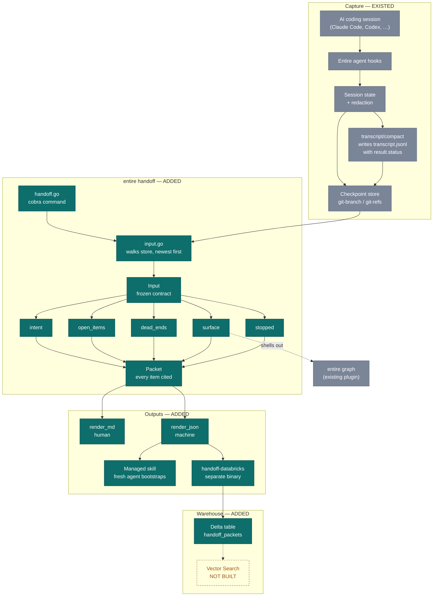
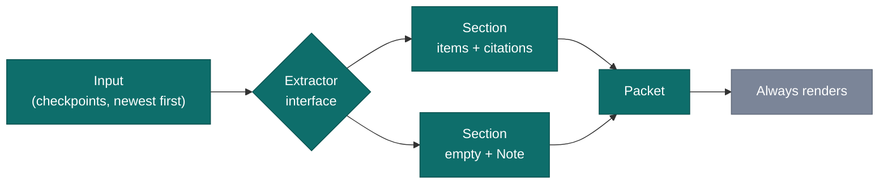

# `entire handoff` — architecture and high-level design

A cited briefing that lets one coding session pick up exactly where the last one
stopped, including the things that were already tried and failed.

Throughout this document:

- **ADDED** — built for this feature.
- **EXISTED** — pre-existing platform we consume without modifying.

---

## What we are building, in plain terms

When someone works with an AI assistant on a piece of software, every new
conversation starts from nothing. The assistant has no memory of yesterday. So it
suggests an approach that was already tried and abandoned last week, asks a
question that was answered on Tuesday, and quietly forgets the three things it
promised to come back to. The only fix available today is a person sitting down
and re-explaining the situation by hand, from memory, every single time — and
people are bad at remembering which of five approaches was the one that did not
work.

The tool this repository already provides quietly records each of those working
sessions as it happens, the way a flight recorder does. Nobody reads those
recordings, because they are enormous and unreadable. What we built is the thing
that reads them for you. Type one command and you get a short briefing: what the
last sessions were trying to achieve, what was left unfinished, *what was already
attempted and failed*, which parts of the system were disturbed, and where work
stopped mid-sentence.

The part that matters most is the smallest. Every single line in that briefing is
stamped with the recording it came from. So none of it is the assistant guessing
or embellishing — each claim can be traced back to the moment it actually
happened, and checked. A briefing you cannot verify is just a rumour with better
formatting.

We then send those briefings to a shared company database. That turns a personal
memory aid into an institutional one: instead of only knowing what *you* tried
last Tuesday, anyone can ask whether *anybody* has attempted this before and how
it went. The failures stop being wasted.

---

## System flow

Grey is the platform that already existed; teal is what we added. We consume the
existing recording pipeline without modifying any part of it.



---

## The seam that made three people possible

Every section is an `Extractor` in its own file. Adding one — including one
demanded by a surprise requirement — is a new file plus a single wiring line, so
three branches never edit the same file twice.



Three properties hold across all five extractors:

**Failure is a Note, not an error.** A section that cannot do its job returns no
items and a reason, never an error. A packet that refuses to print because the
graph was down is worse than useless to whoever needs orienting.

**Every item carries a citation.** Enforced mechanically by
`TestEveryItemIsCited` across all five extractors. An uncited item is a bug, not
a style preference.

**Extractors never touch the store.** All data is loaded once into `Input`, so
every section is a pure function over a struct — which is why the tests run in
milliseconds with no git repository.

---

## What we added, what was already there

| Component | Origin | Role |
| --- | --- | --- |
| `cmd/entire/cli/handoff/` | **ADDED** | Packet contract, store walk, five extractors, both renderers |
| `cmd/entire/cli/handoff.go` | **ADDED** | The cobra command and its flags |
| `cmd/entire/cli/setup_handoff_skill.go` | **ADDED** | Managed skill telling a fresh agent to run the command first |
| `cmd/handoff-databricks/` | **ADDED** | Separate binary: packet JSON → warehouse rows |
| `databricks/ddl.sql` | **ADDED** | Delta table, volume, and a view *shaped for* retrieval |
| 4 registration lines | **ADDED** | `root.go`, `agent_help_cmd.go`, `setup.go`, `root_test.go` |
| `checkpoint.Open` / `PersistentStore` | EXISTED | Reads checkpoints; consumed unchanged |
| `transcript/compact` | EXISTED | Writes the `result.status` the miner reads |
| `api/checkpoint` metadata | EXISTED | `Summary`, `Attribution`, token usage, compact offsets |
| Agent hooks and redaction | EXISTED | Capture and secret-scrubbing before anything is stored |
| `trailers`, `gitrepo`, `gitremote`, `paths` | EXISTED | HEAD checkpoint id, repo open, repo name |
| `writeManagedScaffold` | EXISTED | Safe skill install with conflict detection |
| `entire graph` | EXISTED | External plugin the blast-radius section shells out to |

We changed **no** existing behaviour. Every pre-existing component is read-only
from our side, which is why the entire existing test suite still passes
untouched.

### Files added, in full

```
cmd/entire/cli/handoff.go
cmd/entire/cli/setup_handoff_skill.go
cmd/entire/cli/handoff/
  packet.go          the frozen contract
  input.go           store walk and Input assembly
  build.go           runs every extractor
  extractors.go      the wiring list
  intent.go          section 1
  openitems.go       section 2
  transcript.go      v1 line parser
  deadends.go        section 3
  surface.go         section 4
  stopped.go         section 5
  render_md.go       human output
  render_json.go     machine output
  packet_test.go  input_test.go  deadends_test.go
  surface_test.go  transcript_realdata_test.go
  testdata/transcript.jsonl
cmd/handoff-databricks/
  main.go  rows.go  upload.go
  upload_test.go
  testdata/packet.json
databricks/ddl.sql
```

---

## How to use it

### 1. Read a briefing

Human-readable by default. Nothing is written; it is safe to run at any time.

```bash
entire handoff                 # markdown
entire handoff --limit 20      # reach further back
entire handoff --no-graph      # skip the blast-radius section
```

### 2. Get the machine-readable packet

Stable, documented shape. This is what other tools consume.

```bash
entire handoff --json
entire handoff --json --checkpoint <id>   # start from a specific point
```

### 3. Let a fresh agent bootstrap itself

Installs a skill instructing the agent to run the command *before reading any
file*. This is the whole claim, made real: no pasting.

```bash
entire enable --handoff-skill --agent claude-code
```

### 4. Send briefings to the warehouse

Credentials come from the environment only, never from a settings file — those
are version-controlled, so a token in one ships to everyone who clones.

```bash
# Local dry run — no workspace, no token, no network
DATABRICKS_HOST=file:///tmp/out entire handoff --json | handoff-databricks

# Real workspace
export DATABRICKS_HOST=https://<workspace>.cloud.databricks.com
export DATABRICKS_TOKEN=<token>
export DATABRICKS_WAREHOUSE_ID=<id>
export DATABRICKS_VOLUME_PATH=/Volumes/main/default/handoff
entire handoff --json | handoff-databricks
```

Apply `databricks/ddl.sql` once to create the volume, table, and retrieval view.

### Reading the output

Each line ends with its source, like `[01JQ8Z9K:412]` — the checkpoint id and,
for dead ends, the transcript line. To open the session behind any claim:

```bash
entire checkpoint explain <checkpoint_id>
```

A section may be empty with a note explaining why. That is normal and
deliberate — partial packets are the product.

---

## Data contract

`entire handoff --json` emits this shape. It is a published interface: the
managed skill and the Databricks lane both depend on it. Adding a field is safe;
renaming or removing one is a breaking change for both.

```json
{
  "repo": "gh/acme/cli",
  "generated_at": "2026-09-06T10:40:00Z",
  "head_checkpoint_id": "01JQ8Z9K2M3N4P5Q6R7S8T9V0W",
  "sections": [
    {
      "name": "dead_ends",
      "items": [
        {
          "text": "go test ./... -run TestRecap — failed 2 times: undefined: recapFlags",
          "cites": [
            { "checkpoint_id": "01JQ8Z9K…", "session_index": 0, "line": 412 }
          ]
        }
      ]
    },
    { "name": "surface", "items": [], "note": "graph degenerate: no_dependents" }
  ]
}
```

Section names are part of the contract: `intent`, `open_items`, `dead_ends`,
`surface`, `stopped`. `line` is populated only by the dead-end miner, which is
the one extractor working at line granularity.

### Warehouse schema

One packet becomes N rows, one per `(section, item, citation)`. The merge key is
`(repo_key, checkpoint_id, session_id)` — **never `repo_key` alone**, which is
not unique: a repo without a remote gets a synthetic `local/<basename>`, so two
developers' local clones collide on `local/cli`. Row-level uniqueness needs
`section_name` and `item_index` on top.

Empty sections are stored with `item_index = -1` and their degradation reason.
Dropping them would make a section that degraded indistinguishable from one that
never ran.

---

## Not built

**Vector Search and semantic retrieval do not exist.** `databricks/ddl.sql`
creates a view shaped so an index *could* be built over `item_text`, but there is
no index, no embedding, no retrieval notebook, and no `--ask` flag. The dashed
box in the diagram marks this.

Everything in the packet is **exact string matching**: dead ends group on an
exact command or path, intent dedup only lowercases and collapses whitespace, and
"likely closed" is a substring test. Two semantically identical commands written
differently land in separate entries.

If semantic recall is wanted, this repo already ships `entire search`
(`search_v4.go`), which sends a *query* to entire-api cells that have already
indexed pushed checkpoints. That embeds nothing new, since the content is already
server-side. Databricks Vector Search would instead create a second copy of
transcript-derived text in a third-party system — a new exposure, which is a
product decision rather than a technical one.

---

## Known limits

Stated here rather than discovered later.

- **Dead ends are Claude Code only.** `compact.Compact` sniffs OpenCode, Gemini,
  pi, Codex, Copilot, and Droid before the Claude path, and several agents
  produce no usable `transcript.jsonl` at all.
- **Grouping is a heuristic.** Failures group by `command`, then `file_path` /
  `path` / `pattern`, then tool name. Close variations may split into two
  entries.
- **`dependents_count` can undercount.** It is a heuristic textual identifier
  index rather than a true graph query, and it degrades silently under budget
  pressure. The section discloses this in its own output.
- **Blast radius is untested against live graph output.** It is covered only by
  an injected fake, so the real `entire graph diff` field names are an informed
  guess. A mismatch degrades to the touched-file list rather than breaking.
- **Tool output is truncated to ~200 characters.** A security measure, not
  formatting — transcripts can contain a pasted credential. It is a mitigation,
  not a guarantee: a short key fits inside the budget. The real protection is the
  pre-existing redaction pass, which runs before anything is stored, so the
  packet only ever reads already-scrubbed text.
- **Reading is bounded.** `Load` gives up after `LoadBudget` (10s) or
  `minLoadAttempts` attempts, whichever comes first, and says so in the section
  note. Without that bound a repo whose checkpoints are unhydrated made the
  command hang for minutes, since every attempt is a network fetch.

---

## Verification

```bash
go build ./...                                   # clean
go vet ./cmd/entire/cli/handoff/... ./cmd/handoff-databricks/...
gofmt -l cmd/entire/cli/handoff/ cmd/handoff-databricks/
golangci-lint run ./cmd/entire/cli/handoff/... ./cmd/handoff-databricks/...
go test ./cmd/entire/cli/... ./cmd/handoff-databricks/...
```

The dead-end miner is additionally verified against
`cmd/entire/cli/transcript/compact/testdata/claude_expected2.jsonl` — the compact
writer's own committed expected output, which contains four real
`status:"error"` blocks. That test fails if the writer format and the parser ever
diverge, which a hand-written fixture alone could not catch.
